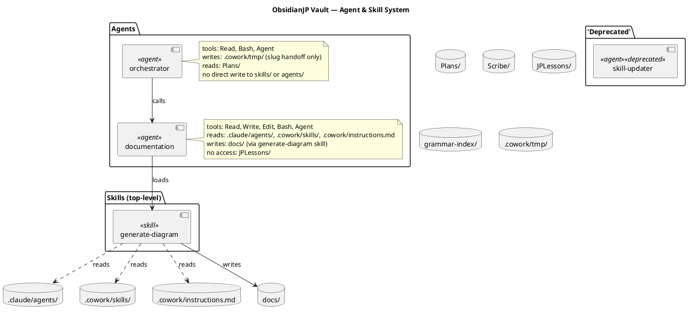

# Generate Diagram Skill

## Trigger

User says any of:
- "generate diagram"
- "update diagram"
- "regenerate vault diagram"

---

## Workflow

### Step 1 — Collect agent files

Run `find /Users/michallebioda/Library/Mobile\ Documents/iCloud~md~obsidian/Documents/ObsidianJP/.claude/agents -name "*.md"` to get all agent file paths. Read each file in full.

### Step 2 — Collect skill files

Run `find /Users/michallebioda/Library/Mobile\ Documents/iCloud~md~obsidian/Documents/ObsidianJP/.cowork/skills -name "*.md"` to get all skill file paths (including subdirectories such as `lesson-to-web/`). Read each file in full. Exclude non-skill files (e.g. any `.py` helper scripts).

### Step 3 — Read instructions.md

Read `.cowork/instructions.md` for project-wide access rules and the agent/skill registry table.

### Step 4 — Extraction pass: agents

For each agent file, record:

- **Agent name** — from `name:` frontmatter field. If absent, derive from the `# Agent: <name>` heading. If that is also absent, use the filename stem (e.g. `orchestrator` from `orchestrator.md`).
- **Tools allowed** — from `tools:` frontmatter list.
- **A2A calls made** — scan for `subagent_type:` lines. Each occurrence is an outbound call edge to that agent.
- **Access rule table rows** — read the `| Path | Access |` table if present. Rows with `Read-only` → agent reads that directory/file. Rows with `Read + Write` or `Write` → agent writes to that directory/file.
- **Files the agent writes directly** — look for "Write to", "Append to", mentions of specific file paths in the workflow section.
- **Directories forbidden** — look for "No access", "Never", "never read or write" to identify paths the agent must not touch.
- **Deprecated agents** — if the file body or description contains the word `DEPRECATED`, annotate the component with `<<deprecated>>` and place it in a separate `package 'Deprecated'` block rather than the main Agents package.

### Step 5 — Extraction pass: skills

For each skill file, record:

- **Skill name** — from `name:` frontmatter field. If absent, derive from the `# Skill: <name>` heading. If that is also absent, use the filename stem (e.g. `fill-templates` from `fill-templates.md`). For files in subdirectories, prefix with the subdirectory name (e.g. `lesson-to-web/extract-grammar`).
- **Trigger phrases** — from the `## Trigger` section.
- **Skill chains** — scan for `Load .cowork/skills/...` or explicit chain references to other skill names. Each such reference is a dependency edge from this skill to the named skill.
- **Files/directories read and written** — from workflow steps: look for `Read`, `Write`, `Append`, and explicit path mentions.
- **"Never touch" list** — from the `## Never touch` section.
- **Script invocations** — scan for `python3 <path>` or named bash script calls. Annotate the skill component with a PlantUML `note` block listing each script path found.

### Step 6 — Emit the .puml file

Write the diagram to `docs/vault-system-diagram.puml` (vault root). Create the `docs/` directory implicitly if it does not exist. Overwrite any existing file.

Use the following notation style for the output:

- Agents: `component [agent-name] as AgentName <<agent>>`
- Skills (top-level): placed in `package "Skills (top-level)"`
- Skills (subdirectory e.g. lesson-to-web): placed in `package "Skills (lesson-to-web)"`
- Reference files / directories: `database "path/" as PathAlias`
- Agent calls agent: `AgentName --> OtherAgent : calls`
- Skill chains to skill: `SkillA --> SkillB : chains`
- Agent reads path: `AgentName ..> PathAlias : reads`
- Agent writes path: `AgentName --> PathAlias : writes`
- Skill reads path: `SkillName ..> PathAlias : reads`
- Skill writes path: `SkillName --> PathAlias : writes`
- Permission annotations: add a `note right of <Component>` block per agent listing allowed tools and key forbidden paths.
- Deprecated agents: place in a separate `package 'Deprecated'` block with `<<deprecated>>` stereotype.
- Script invocations: add a `note` block on the skill component listing script paths.

**Canonical notation example (style reference only — do not copy relationships verbatim; extract them from real files):**



Group agents in a `package "Agents"` block (with a separate `package 'Deprecated'` block for deprecated agents) and skills in `package "Skills (top-level)"` / `package "Skills (lesson-to-web)"` etc. as appropriate.

### Step 7 — Report

Tell the user:
- The output path: `docs/vault-system-diagram.puml`
- A one-line summary of what was captured, e.g.: "5 agents, 12 skills, N relationships extracted."
- If any agent or skill file could not be read, list those paths and note that they were skipped.

### Step 8 — Call scribe (A2A)

After writing the file, call scribe with:

```
subagent_type: scribe
prompt:
MODE: capture
AGENT: documentation
CHANGED: docs/vault-system-diagram.puml
REASON: Vault system diagram generated/regenerated
CLASSIFICATION: new-feature
COMMIT: uncommitted
```

---

## Extraction rules (edge reference table)

| Pattern found in file | Edge type |
|---|---|
| `subagent_type: X` | agent calls agent X |
| `Load .cowork/skills/X` or chain reference to skill X | skill chains to skill X |
| Access table row: `Path \| Read-only` | agent reads directory |
| Access table row: `Path \| Read + Write` or `Write` | agent writes to directory |
| `## Never touch` list item | annotate component with restriction |
| `tools:` frontmatter | annotate component with allowed tools |
| `python3 <path>` or named bash script call | annotate skill with script note |

---

## Hard rules

- **Only write `vault-system-diagram.puml`** — never touch any other file in `docs/` or anywhere else. The only output file is `docs/vault-system-diagram.puml`.
- Extract relationships from real files at runtime. Do not hard-code any relationship from the canonical example above.
- If any agent or skill file cannot be read, skip it and note the gap in the report. Do not abort the entire run.
- If `docs/` cannot be created or written, report the error and stop — do not write partial output elsewhere.

---

## Never touch

- Lesson files under `JPLessons/` (no access — never read or write)
- `<!--ID: -->` lines anywhere
- `TARGET DECK` lines
- `.cowork/skills/` — read-only in this skill's context (never modify skill files)
- `.claude/agents/` — read-only in this skill's context (never modify agent files)
- `.cowork/instructions.md` — read-only
- `Plans/` — no access
- `Scribe/` — no access (scribe writes its own logs)
- Do not run `git push` or any remote git operation
- Do not write any file other than `docs/vault-system-diagram.puml`
