# Documentation Agent — Vault System Diagram

## Goal

Generate a PlantUML Component Diagram that maps the full agent/skill system of this vault: which agents call which agents, which skills chain into other skills, what rule/reference files each component depends on, and what read/write permissions each component holds. The output is a `.puml` file saved under `docs/` so it can be version-controlled and rendered externally (e.g. via PlantUML server, VS Code plugin, or kroki.io). This gives the user a single visual source of truth for how the system is wired, which is invaluable when the system grows or a new contributor needs to understand it.

## Approach

Two new files are created:

1. **`.claude/agents/documentation.md`** — a lightweight agent that wraps the generate-diagram skill. It can be called standalone ("generate diagram") or could be triggered from the orchestrator pipeline in the future. It does not call reviewer or planner (it is a generation utility, not a change agent); it does call scribe after writing output, consistent with other agents that produce new files.

2. **`.cowork/skills/generate-diagram.md`** — the skill that does the actual work. It reads every agent file in `.claude/agents/` and every skill file in `.cowork/skills/` (recursively, including `lesson-to-web/`), extracts relationships and permissions by following a fixed extraction protocol, then emits a `.puml` file to `docs/vault-system-diagram.puml`. The skill uses a declarative extraction approach: it scans for known patterns (A2A call blocks, access rule tables, "reads from"/"writes to" mentions, skill chain references) rather than trying to parse free-form prose.

Key trade-off: the diagram is authored by Claude reading the source files — it is not auto-generated by a script. This means it can capture intent and prose descriptions that a regex parser would miss, but it also means the diagram needs to be regenerated manually when the system changes. To make re-generation cheap, the skill's trigger is a single phrase.

## Steps

### Step 1 — Create `docs/` directory marker

- Path: `docs/` at vault root
- Action: the skill will create the directory implicitly when writing the output file; no separate step needed. Document this expectation in the skill.

### Step 2 — Create skill file `.cowork/skills/generate-diagram.md`

Full skill spec:

**Trigger phrases:**
- "generate diagram"
- "update diagram"
- "regenerate vault diagram"

**Workflow the skill must follow:**

1. **Collect agent files** — list all `.md` files in `.claude/agents/` (Bash: `find`). Read each in full.

2. **Collect skill files** — list all `.md` files in `.cowork/skills/` recursively (Bash: `find -name "*.md"`). Exclude `.py` files and non-skill files. Read each in full.

3. **Read `.cowork/instructions.md`** — for project-wide access rules and the agent/skill registry table.

4. **Extraction pass — for each agent file, record:**
   - Agent name (from `name:` frontmatter field; if absent, derive from the `# Agent: <name>` heading or the filename stem)
   - Tools allowed (from `tools:` frontmatter list)
   - A2A calls made: scan for `subagent_type:` lines → each is an outbound call edge
   - Access rule table rows (read the `| Path | Access |` table if present) → these become read/write permission annotations
   - Files the agent writes directly (look for `Write to`, `Append to`, mentions of specific file paths in the workflow)
   - Directories the agent is explicitly forbidden from accessing (look for "No access", "Never", "never read or write")
   - **Deprecated agents:** if the file body or description contains the word `DEPRECATED`, annotate the component with `<<deprecated>>` and place it in a separate `package 'Deprecated'` block rather than the main Agents package

5. **Extraction pass — for each skill file, record:**
   - Skill name (from `name:` frontmatter field; if absent, derive from the `# Skill: <name>` heading or the filename stem)
   - Trigger phrases (from `## Trigger` section)
   - Skills this skill chains to: scan for `Load .cowork/skills/...` or explicit chain tables → these become dependency edges
   - Files/directories it reads and writes (from the workflow steps — look for `Read`, `Write`, `Append`, path mentions)
   - "Never touch" list (from `## Never touch` section)
   - **Script invocations:** scan for `python3 <path>` or named bash script calls → annotate the skill component with a PlantUML `note` block listing each script path found

6. **Emit `.puml` file** — write to `docs/vault-system-diagram.puml` using the notation defined below. Overwrite if it exists.

7. **Report** — tell the user the output path and a one-line summary of what was captured (e.g. "5 agents, 12 skills, N relationships").

8. **Call scribe** — A2A call after writing the file:
   ```
   MODE: capture
   AGENT: documentation
   CHANGED: docs/vault-system-diagram.puml
   REASON: Vault system diagram generated/regenerated
   CLASSIFICATION: new-feature
   COMMIT: uncommitted
   ```

**Extraction rules (what counts as an edge):**

| Pattern found in file | Edge type |
|---|---|
| `subagent_type: X` | agent calls agent X |
| `Load .cowork/skills/X` or `run X` (skill name) | skill chains to skill X |
| Access table row: `Path \| Read-only` | agent reads directory |
| Access table row: `Path \| Read + Write` | agent writes to directory |
| `## Never touch` list item | annotate component with restriction |
| `tools:` frontmatter | annotate component with allowed tools |

**PlantUML notation style (see example below):**

- Agents: `component [agent-name] as AgentName <<agent>>`
- Skills: `component [skill-name] as SkillName <<skill>>`
- Reference files / directories: `database "path/" as PathAlias`
- Agent→agent calls: `AgentName --> OtherAgent : calls`
- Skill→skill chains: `SkillA --> SkillB : chains`
- Agent reads directory: `AgentName ..> PathAlias : reads`
- Agent writes directory: `AgentName --> PathAlias : writes`
- Skill reads path: `SkillName ..> PathAlias : reads`
- Skill writes path: `SkillName --> PathAlias : writes`
- Permission annotations: add a note block per agent listing allowed tools and forbidden paths

Group agents and skills in separate `package` blocks for visual clarity.

**Example PlantUML snippet (canonical reference):**

```plantuml
@startuml vault-system-diagram
title ObsidianJP Vault — Agent & Skill System

' ─── Shared storage ───
database ".claude/agents/" as AgentsDir
database ".cowork/skills/" as SkillsDir
database "Plans/" as PlansDir
database "Scribe/" as ScribeDir
database ".cowork/instructions.md" as Instructions
database "docs/" as DocsDir
database "JPLessons/" as Lessons
database "grammar-index/" as GrammarIndex
database ".cowork/tmp/" as TmpDir

' ─── Agents ───
package "Agents" {
  component [orchestrator] as Orchestrator <<agent>>
  note right of Orchestrator
    tools: Read, Bash, Agent
    writes: .cowork/tmp/ (slug handoff only)
    reads: Plans/
    no direct write to skills/ or agents/
  end note

  component [reviewer] as Reviewer <<agent>>
  note right of Reviewer
    tools: Read, Bash, Agent
    reads: .cowork/skills/, .claude/agents/, Plans/, Scribe/
    no access: JPLessons/
    never writes any file
  end note

  component [planner] as Planner <<agent>>
  note right of Planner
    tools: Read, Write, Edit, Bash, Agent
    writes: Plans/ only
  end note

  component [skill-implementer] as SkillImpl <<agent>>
  note right of SkillImpl
    tools: Read, Write, Edit, Bash, Agent
    writes: .cowork/skills/, .claude/agents/
    reads: Plans/, JPLessons/ (context only)
    never modifies lesson files unless explicitly asked
  end note

  component [scribe] as Scribe <<agent>>
  note right of Scribe
    tools: Read, Write, Edit, Bash
    writes: Scribe/
    reads: .cowork/, .claude/, git log
    no access: JPLessons/
  end note

  component [documentation] as Documentation <<agent>>
  note right of Documentation
    tools: Read, Bash, Agent
    reads: .claude/agents/, .cowork/skills/, .cowork/instructions.md
    writes: docs/ (via generate-diagram skill)
    no access: JPLessons/
  end note
}

' ─── Agent → Agent calls ───
Orchestrator --> Reviewer : calls (Stage 1)
Orchestrator --> Planner : calls (Stage 2)
Orchestrator --> SkillImpl : calls (Stage 3)
Reviewer --> Scribe : calls (Step 4, always)
Reviewer --> Planner : calls (Step 5, if user confirms)
Planner --> Scribe : calls (on plan completion)
SkillImpl --> Scribe : calls (per changed file)

' ─── Agent → Storage ───
Orchestrator --> TmpDir : writes
Orchestrator ..> PlansDir : reads
Reviewer ..> SkillsDir : reads
Reviewer ..> AgentsDir : reads
Reviewer ..> Instructions : reads
Planner --> PlansDir : writes
SkillImpl --> SkillsDir : writes
SkillImpl --> AgentsDir : writes
SkillImpl ..> PlansDir : reads
Scribe --> ScribeDir : writes
Documentation ..> AgentsDir : reads
Documentation ..> SkillsDir : reads
Documentation ..> Instructions : reads

' ─── Skills ───
package "Skills (top-level)" {
  component [fill-templates] as FillTemplates <<skill>>
  component [kanji-headers] as KanjiHeaders <<skill>>
  component [update-kanji-list] as UpdateKanjiList <<skill>>
  component [practice-grammar] as PracticeGrammar <<skill>>
  component [summarize-grammar] as SummarizeGrammar <<skill>>
  component [generate-diagram] as GenerateDiagram <<skill>>
  component [git-commit] as GitCommit <<skill>>
}

package "Skills (lesson-to-web)" {
  component [update-grammar] as UpdateGrammar <<skill>>
  component [preprocess-grammar] as PreprocessGrammar <<skill>>
  component [review-grammar] as ReviewGrammar <<skill>>
  component [structure-grammar] as StructureGrammar <<skill>>
  component [see-also-grammar] as SeeAlsoGrammar <<skill>>
  component [extract-grammar] as ExtractGrammar <<skill>>
  component [extract-vocabulary] as ExtractVocab <<skill>>
}

' ─── Skill chains ───
KanjiHeaders --> UpdateKanjiList : chains
UpdateGrammar --> PreprocessGrammar : chains
UpdateGrammar --> ReviewGrammar : chains
UpdateGrammar --> StructureGrammar : chains
UpdateGrammar --> SeeAlsoGrammar : chains
ExtractGrammar --> UpdateGrammar : triggers

' ─── Documentation agent → skill ───
Documentation --> GenerateDiagram : loads

' ─── Skill → Storage ───
GenerateDiagram ..> AgentsDir : reads
GenerateDiagram ..> SkillsDir : reads
GenerateDiagram ..> Instructions : reads
GenerateDiagram --> DocsDir : writes
FillTemplates ..> Lessons : reads
PracticeGrammar ..> Lessons : reads
SummarizeGrammar --> GrammarIndex : writes
ExtractGrammar --> GrammarIndex : writes
ExtractVocab ..> Lessons : reads

@enduml
```



Use this as the **notation style reference only** — actual relationships must be extracted from real files at runtime.

### Step 3 — Create agent file `.claude/agents/documentation.md`

**YAML frontmatter:**
```yaml
name: documentation
description: >
  Generates a PlantUML Component Diagram of the vault's agent/skill system.
  Reads all agent files in .claude/agents/ and all skill files in .cowork/skills/,
  extracts relationships, permissions, and chains, then writes docs/vault-system-diagram.puml.
  Trigger: "generate diagram", "update diagram", or "regenerate vault diagram".
tools:
  - Read
  - Write
  - Edit
  - Bash
  - Agent
```

**Body (system prompt outline):**

- Role statement: generation utility agent; does not modify skills or agents; does not call reviewer or planner.
- Vault root anchor.
- Access rules table:

| Path | Access |
|---|---|
| `.claude/agents/` | Read-only |
| `.cowork/skills/` | Read-only |
| `.cowork/instructions.md` | Read-only |
| `docs/` | Write (create directory + write `.puml` file) |
| `JPLessons/` | No access |
| `Scribe/` | No access (scribe writes its own logs) |
| `Plans/` | No access |
| Any git write operation | Never |

- Trigger phrases (same as skill).
- Workflow: "Load `.cowork/skills/generate-diagram.md` and follow its instructions exactly."
- Hard rules:
  - Never write to `.cowork/`, `.claude/`, `JPLessons/`, `Plans/`, or `Scribe/`
  - Never modify any agent or skill file
  - Never run destructive git commands
  - Output goes to `docs/` only
  - **SCRIBE CALL RULE: Scribe is called by the generate-diagram skill. Do NOT call scribe from the agent body — this causes a double capture.**
- Error handling:
  - If any agent or skill file cannot be read, report the path and skip it — note the gap in the diagram output rather than aborting entirely
  - If `docs/` cannot be created or written, report and stop

### Step 4 — Update `.cowork/instructions.md` trigger entry

Add the documentation agent to the "Available skills" / agent list section of `.cowork/instructions.md` so it appears in future reviewer cross-checks.

- Path: `.cowork/instructions.md`
- Change: add the following line to the agent system section (after the `scribe` entry and before the `skill-updater` deprecated entry), matching the bold-backtick style used for the existing entries:

  ```
  **`documentation`** — generates a PlantUML component diagram of the vault's agent/skill system. Reads all agent and skill files, extracts relationships and permissions, writes `docs/vault-system-diagram.puml`. Trigger: "generate diagram", "update diagram", "regenerate vault diagram".
  ```

- Note: this file is protected — skill-implementer must ask the user for explicit confirmation before touching it

### Step 5 — Modify `skill-implementer.md` to auto-trigger documentation agent

**NEW USER REQUIREMENT (highest priority)**

After `skill-implementer` creates, deletes, or modifies any file in `.claude/agents/` or `.cowork/skills/`, it must automatically call the documentation agent (A2A) to regenerate `docs/vault-system-diagram.puml`.

- Path: `.claude/agents/skill-implementer.md`
- Change: add a new step to the skill-implementer workflow, after the existing "call scribe after each changed file" step:

  > "After writing, editing, or deleting any file under `.claude/agents/` or `.cowork/skills/`, call the `documentation` agent (A2A, `subagent_type: documentation`) to regenerate `docs/vault-system-diagram.puml`. This call is made once per skill-implementer run, after all file changes are complete — not once per file."

- **Protected file note:** `.claude/agents/skill-implementer.md` is a core agent file. Skill-implementer must ask the user for explicit confirmation before modifying it, the same as for the `instructions.md` update in Step 4.

### Step 6 — Create `docs/` directory (implicit)

The skill creates this directory when it first writes the `.puml` file. No separate action needed. Expected first-write path: `docs/vault-system-diagram.puml`.

**First-run race condition note:** On first run, `docs/` does not exist yet when scribe captures the path. The Write call creates it, but scribe's git-diff check will find nothing if the file has not yet been staged. This is expected behaviour: scribe falls back to caller-supplied fields (`CHANGED`, `REASON`, `CLASSIFICATION`) when git diff finds nothing. No special handling is required.

## Risks

- **`.cowork/instructions.md` is protected** — Step 4 modifies this file. Skill-implementer must ask the user explicitly before touching it. If the user declines, the agent will simply not appear in the registry until manually added.
- **`.claude/agents/skill-implementer.md` is protected** — Step 5 modifies a core agent file. Skill-implementer must ask the user for explicit confirmation before touching it. If the user declines, the auto-trigger behaviour will not be active and diagram regeneration must be triggered manually.
- **Diagram drift** — the `.puml` file is generated by Claude reading files at a point in time. It will go stale when new agents/skills are added. Mitigation: the "update diagram" trigger makes regeneration cheap; no automated freshness check is planned.
- **`docs/` conflicts** — if the user has other files in `docs/`, the skill only writes `vault-system-diagram.puml` and must not touch other files in that directory. The skill spec must include an explicit "only write `vault-system-diagram.puml`" rule.
- **No `Write` tool in agent frontmatter** — the documentation agent has `Read`, `Bash`, `Agent` only; it delegates writing to the generate-diagram skill which is executed by Claude in-context (skill files are instructions, not separate processes). Since Claude running the skill has the same tool access as the agent that loaded it, the agent needs `Write` and `Edit` in its `tools:` list. Adjust frontmatter to include `Write` and `Edit`.
- **Double scribe call** — if both the agent body and the skill both call scribe, the capture fires twice. The plan resolves this by having the skill call scribe and the agent body say "scribe is called by the skill — do not call again."
